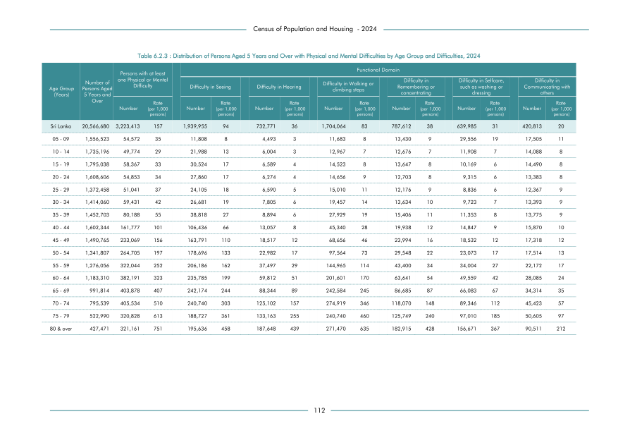

# Distribution of Persons Aged 5 Years and Over with Physical and Mental Difficulties by Age Group andDifficulties, 2024


*Table 6.2.3, Final Report, 2024 Census of Population and Housing, Department of Census and Statistics, Sri Lanka*

## Structured Data formatted for [Lanka Data API](https://github.com/nuuuwan/lanka_data)

```json
{
    "Person": {
        "Time:2024": {
            "AgeGroup:0To125Years": {
                "DisabilityTypes:difficulty_in_seeing": {
                    "Count": "Int:1939955"
                },
                "DisabilityTypes:difficulty_in_hearing": {
                    "Count": "Int:732771"
                },
                "DisabilityTypes:difficulty_in_walking_or_climbing_steps": {
                    "Count": "Int:1704064"
                },
                "DisabilityTypes:difficulty_in_remembering_or_concentrating": {
                    "Count": "Int:787612"
                },
                "DisabilityTypes:difficulty_in_selfcare_such_as_washing_or_dressing": {
                    "Count": "Int:639985"
                },
                "DisabilityTypes:difficulty_in_communicating_with_others": {
                    "Count": "Int:420813"
                },
                "DisabilityTypes:no_disability": {
                    "Count": "Int:14341480"
                }
            },
            "AgeGroup:5To9Years": {
                "DisabilityTypes:difficulty_in_seeing": {
                    "Count": "Int:11808"
                },
...
```

- Source File: [lanka_data.json (12.8 KB)](../../../../data/final-report-tables/chapter-6/6.2.3-Distribution-of-Persons-Aged-5-Years-and-Over-with-Physical-and-Mental-Difficulties-by-Age-Group-andDifficulties-2024/lanka_data.json)

## Structured Data (similar to original layout)

```json
[
    {
        "age_group": "Sri Lanka",
        "values": {
            "difficulty_in_seeing": 1939955,
            "difficulty_in_hearing": 732771,
            "difficulty_in_walking_or_climbing_steps": 1704064,
            "difficulty_in_remembering_or_concentrating": 787612,
            "difficulty_in_selfcare_such_as_washing_or_dressing": 639985,
            "difficulty_in_communicating_with_others": 420813,
            "no_disability": 14341480
        },
        "total_description": "population_aged_5_years_and_above",
        "total_value": 6225200
    },
    {
        "age_group": "05 - 09",
        "values": {
            "difficulty_in_seeing": 11808,
            "difficulty_in_hearing": 4493,
            "difficulty_in_walking_or_climbing_steps": 11683,
            "difficulty_in_remembering_or_concentrating": 13430,
            "difficulty_in_selfcare_such_as_washing_or_dressing": 29556,
            "difficulty_in_communicating_with_others": 17505,
            "no_disability": 1468048
        },
        "total_description": "population_aged_5_years_and_above",
        "total_value": 88475
    },
    {
...
```

- Source File: [data.json (8.2 KB)](../../../../data/final-report-tables/chapter-6/6.2.3-Distribution-of-Persons-Aged-5-Years-and-Over-with-Physical-and-Mental-Difficulties-by-Age-Group-andDifficulties-2024/data.json)

## Raw Data (directly scraped from PDF)

```json
[
    [
        "",
        "",
        "Persons with at least",
        "",
        "",
        "",
        "",
        "",
        "",
        "Functional Domain",
        "",
        "",
        "",
        "",
        "",
        ""
    ],
    [
        "",
        "Number of",
        "one Physical or Mental \nDifficulty",
        "",
        "Difficulty in Seeing",
        "",
        "",
        "Difficulty in Hearing",
        "",
        "Difficulty in Walking or",
...
```
- Source File: [raw_data.json (4.7 KB)](../../../../data/final-report-tables/chapter-6/6.2.3-Distribution-of-Persons-Aged-5-Years-and-Over-with-Physical-and-Mental-Difficulties-by-Age-Group-andDifficulties-2024/raw_data.json)

## Original PDF Page



- Source File: [original.pdf (60.5 KB)](../../../../data/final-report-tables/chapter-6/6.2.3-Distribution-of-Persons-Aged-5-Years-and-Over-with-Physical-and-Mental-Difficulties-by-Age-Group-andDifficulties-2024/original.pdf)

## Source

- <https://www.statistics.gov.lk/Resource/en/Population/CPH_2024/CPH2024_Final_Eng.pdf#page=129>


[](https://opensource.org/licenses/MIT)
