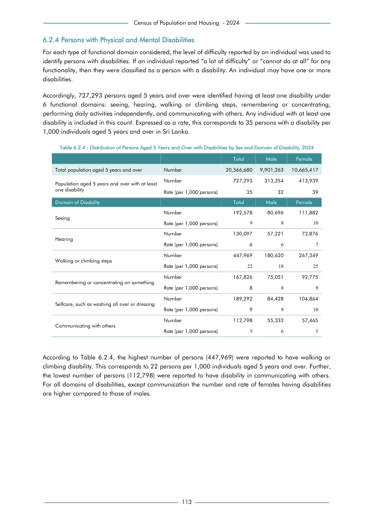

# Distribution of Persons Aged 5 Years and Over with Disabilities by Sex and Domain of Disability, 2024


*Table 6.2.4, Final Report, 2024 Census of Population and Housing, Department of Census and Statistics, Sri Lanka*

## Raw Data (directly scraped from PDF)

```json
[
    [
        "",
        "Census of Population and Housing  - 2024"
    ],
    [
        "6.2.4 Persons with Physical and Mental Disabilities",
        ""
    ],
    [
        "For each type of functional domain considered, the level of difficulty reported by an individual was used to",
        ""
    ],
    [
        "identify persons with disabilities. If an individual reported \u201ca lot of difficulty\u201d or \u201ccannot do at all\u201d for any",
        ""
    ],
    [
        "functionality, then they were classified as a person with a disability. An individual may have one or more",
        ""
    ],
    [
        "disabilities.",
        ""
    ],
    [
        "Accordingly, 727,293 persons aged 5 years and over were identified having at least one disability under",
        ""
    ],
    [
...
```
- Source File: [raw_data.json (2.9 KB)](../../../../data/final-report-tables/chapter-6/6.2.4-Distribution-of-Persons-Aged-5-Years-and-Over-with-Disabilities-by-Sex-and-Domain-of-Disability-2024/raw_data.json)

## Original PDF Page



- Source File: [original.pdf (44.4 KB)](../../../../data/final-report-tables/chapter-6/6.2.4-Distribution-of-Persons-Aged-5-Years-and-Over-with-Disabilities-by-Sex-and-Domain-of-Disability-2024/original.pdf)

## Source

- <https://www.statistics.gov.lk/Resource/en/Population/CPH_2024/CPH2024_Final_Eng.pdf#page=130>


[](https://opensource.org/licenses/MIT)
