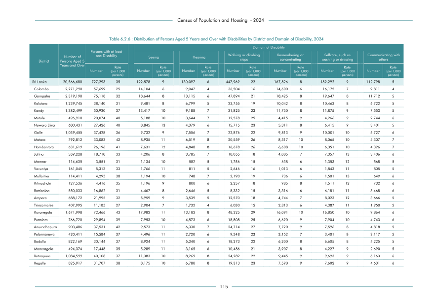

# Distribution of Persons Aged 5 Years and Over with Disabilities by District and Domain of Disability, 2024


*Table 6.2.6, Final Report, 2024 Census of Population and Housing, Department of Census and Statistics, Sri Lanka*

## Structured Data formatted for [Lanka Data API](https://github.com/nuuuwan/lanka_data)

```json
{
    "Person": {
        "Time:2024": {
            "District:colombo": {
                "DisabilityTypes:difficulty_in_seeing": {
                    "Count": "Int:14104"
                },
                "DisabilityTypes:hearing_difficulty": {
                    "Count": "Int:9047"
                },
                "DisabilityTypes:walking_difficulty": {
                    "Count": "Int:36504"
                },
                "DisabilityTypes:cognitive_difficulty": {
                    "Count": "Int:14600"
                },
                "DisabilityTypes:selfcare_difficulty": {
                    "Count": "Int:16175"
                },
                "DisabilityTypes:social_difficulty": {
                    "Count": "Int:9811"
                },
                "DisabilityTypes:no_disability": {
                    "Count": "Int:2171049"
                }
            },
            "District:gampaha": {
                "DisabilityTypes:difficulty_in_seeing": {
                    "Count": "Int:18644"
                },
...
```

- Source File: [lanka_data.json (16.2 KB)](../../../../data/final-report-tables/chapter-6/6.2.6-Distribution-of-Persons-Aged-5-Years-and-Over-with-Disabilities-by-District-and-Domain-of-Disability-2024/lanka_data.json)

## Structured Data (similar to original layout)

```json
[
    {
        "region_id": "LK-11",
        "region_name": "Colombo",
        "region_ent_type": "district",
        "values": {
            "difficulty_in_seeing": 14104,
            "difficulty_in_hearing": 9047,
            "difficulty_in_walking_or_climbing_steps": 36504,
            "difficulty_in_remembering_or_concentrating": 14600,
            "difficulty_in_selfcare_such_as_washing_or_dressing": 16175,
            "difficulty_in_communicating_with_others": 9811,
            "no_disability": 2171049
        },
        "total_value": 100241
    },
    {
        "region_id": "LK-12",
        "region_name": "Gampaha",
        "region_ent_type": "district",
        "values": {
            "difficulty_in_seeing": 18644,
            "difficulty_in_hearing": 13115,
            "difficulty_in_walking_or_climbing_steps": 47894,
            "difficulty_in_remembering_or_concentrating": 18425,
            "difficulty_in_selfcare_such_as_washing_or_dressing": 19647,
            "difficulty_in_communicating_with_others": 11712,
            "no_disability": 2189753
        },
        "total_value": 129437
...
```

- Source File: [data.json (27.1 KB)](../../../../data/final-report-tables/chapter-6/6.2.6-Distribution-of-Persons-Aged-5-Years-and-Over-with-Disabilities-by-District-and-Domain-of-Disability-2024/data.json)

## Raw Data (directly scraped from PDF)

```json
[
    [
        "",
        "Persons with at least \none Disability",
        "",
        "",
        "",
        "",
        "",
        "",
        "Walking or climbing",
        "",
        "Remembering or",
        "",
        "Selfcare, such as",
        "",
        "Communicating with"
    ],
    [
        "Number of \nPersons Aged 5 \nDistrict",
        "",
        "",
        "Seeing",
        "",
        "Hearing",
        "",
        "steps",
        "",
        "",
        "concentrating",
...
```
- Source File: [raw_data.json (5.9 KB)](../../../../data/final-report-tables/chapter-6/6.2.6-Distribution-of-Persons-Aged-5-Years-and-Over-with-Disabilities-by-District-and-Domain-of-Disability-2024/raw_data.json)

## Original PDF Page



- Source File: [original.pdf (68.8 KB)](../../../../data/final-report-tables/chapter-6/6.2.6-Distribution-of-Persons-Aged-5-Years-and-Over-with-Disabilities-by-District-and-Domain-of-Disability-2024/original.pdf)

## Source

- <https://www.statistics.gov.lk/Resource/en/Population/CPH_2024/CPH2024_Final_Eng.pdf#page=132>


[](https://opensource.org/licenses/MIT)
