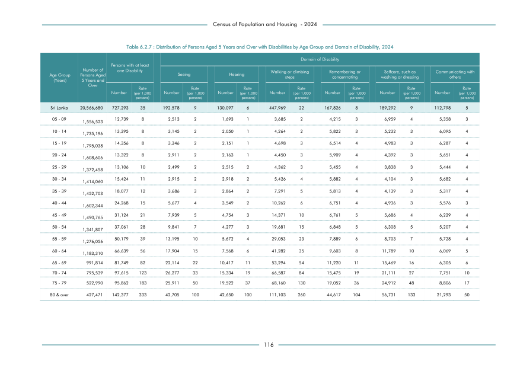

# Distribution of Persons Aged 5 Years and Over with Disabilities by Age Group and Domain of Disability,


*Table 6.2.7, Final Report, 2024 Census of Population and Housing, Department of Census and Statistics, Sri Lanka*

## Structured Data formatted for [Lanka Data API](https://github.com/nuuuwan/lanka_data)

```json
{
    "Person": {
        "Time:2024": {
            "AgeGroup:5To9Years": {
                "DisabilityTypes:difficulty_in_seeing": {
                    "Count": "Int:2513"
                },
                "DisabilityTypes:hearing_difficulty": {
                    "Count": "Int:1693"
                },
                "DisabilityTypes:walking_difficulty": {
                    "Count": "Int:3685"
                },
                "DisabilityTypes:cognitive_difficulty": {
                    "Count": "Int:4215"
                },
                "DisabilityTypes:selfcare_difficulty": {
                    "Count": "Int:6959"
                },
                "DisabilityTypes:social_difficulty": {
                    "Count": "Int:5358"
                },
                "DisabilityTypes:no_disability": {
                    "Count": "Int:1532100"
                }
            },
            "AgeGroup:10To14Years": {
                "DisabilityTypes:difficulty_in_seeing": {
                    "Count": "Int:3145"
                },
...
```

- Source File: [lanka_data.json (10.5 KB)](../../../../data/final-report-tables/chapter-6/6.2.7-Distribution-of-Persons-Aged-5-Years-and-Over-with-Disabilities-by-Age-Group-and-Domain-of-Disability-/lanka_data.json)

## Structured Data (similar to original layout)

```json
[
    {
        "age_group": "Sri Lanka",
        "values": {
            "difficulty_in_seeing": 192578,
            "difficulty_in_hearing": 130097,
            "difficulty_in_walking_or_climbing_steps": 447969,
            "difficulty_in_remembering_or_concentrating": 167826,
            "difficulty_in_selfcare_such_as_washing_or_dressing": 189292,
            "difficulty_in_communicating_with_others": 112798,
            "no_disability": 19326120
        },
        "total_value": 1240560
    },
    {
        "age_group": "05 - 09",
        "values": {
            "difficulty_in_seeing": 2513,
            "difficulty_in_hearing": 1693,
            "difficulty_in_walking_or_climbing_steps": 3685,
            "difficulty_in_remembering_or_concentrating": 4215,
            "difficulty_in_selfcare_such_as_washing_or_dressing": 6959,
            "difficulty_in_communicating_with_others": 5358,
            "no_disability": 1532100
        },
        "total_value": 24423
    },
    {
        "age_group": "10 - 14",
        "values": {
...
```

- Source File: [data.json (7.1 KB)](../../../../data/final-report-tables/chapter-6/6.2.7-Distribution-of-Persons-Aged-5-Years-and-Over-with-Disabilities-by-Age-Group-and-Domain-of-Disability-/data.json)

## Raw Data (directly scraped from PDF)

```json
[
    [
        "",
        "Table 6.2.7 : Distribution of Persons Aged 5 Years and Over with Disabilities by Age Group and Domain of Disability, 2024",
        "",
        "",
        "",
        "",
        "",
        "",
        "",
        "",
        "",
        ""
    ],
    [
        "Persons with at least",
        "",
        "",
        "",
        "",
        "",
        "Domain of Disability",
        "",
        "",
        "",
        "",
        ""
    ],
    [
...
```
- Source File: [raw_data.json (4.9 KB)](../../../../data/final-report-tables/chapter-6/6.2.7-Distribution-of-Persons-Aged-5-Years-and-Over-with-Disabilities-by-Age-Group-and-Domain-of-Disability-/raw_data.json)

## Original PDF Page



- Source File: [original.pdf (60.4 KB)](../../../../data/final-report-tables/chapter-6/6.2.7-Distribution-of-Persons-Aged-5-Years-and-Over-with-Disabilities-by-Age-Group-and-Domain-of-Disability-/original.pdf)

## Source

- <https://www.statistics.gov.lk/Resource/en/Population/CPH_2024/CPH2024_Final_Eng.pdf#page=133>


[](https://opensource.org/licenses/MIT)
