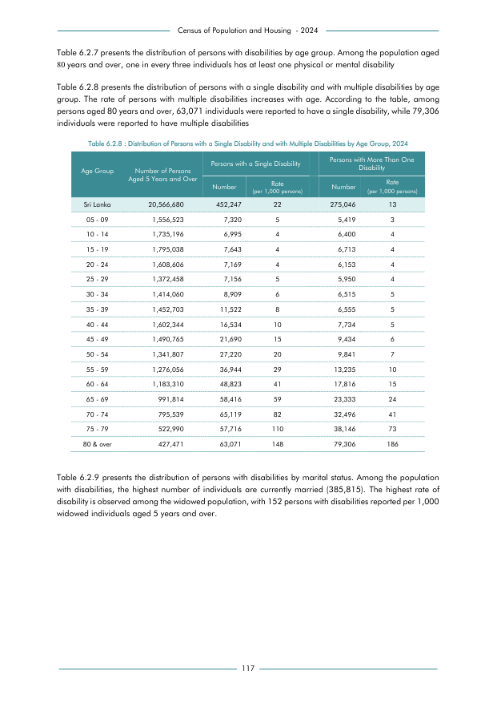

# Distribution of Persons with a Single Disability and with Multiple Disabilities by Age Group, 2024


*Table 6.2.8, Final Report, 2024 Census of Population and Housing, Department of Census and Statistics, Sri Lanka*

## Structured Data formatted for [Lanka Data API](https://github.com/nuuuwan/lanka_data)

```json
{
    "_meta": {
        "source_url": "https://www.statistics.gov.lk/Resource/en/Population/CPH_2024/CPH2024_Final_Eng.pdf#page=134",
        "source_description": [
            "Table 6.2.8, Final Report, 2024 Census of Population and Housing, Department of Census and Statistics, Sri Lanka"
        ],
        "what": {
            "DisabilitiesByAgeGroupSingleOrMultiple": "Distribution of Persons with a Single Disability and with Multiple Disabilities by Age Group, 2024"
        },
        "when": "2024",
        "where_who_types": [
            "age_group"
        ]
    },
    "DisabilitiesByAgeGroupSingleOrMultiple": {
        "2024": {
            "Sri Lanka": {
                "age_group": "Sri Lanka",
                "values": {
                    "NoDisability": 19839387,
                    "WithSingleDisability": 452247,
                    "WithMoreThanOneDisability": 275046
                },
                "total_value": 20566680,
                "pct_values": {
                    "NoDisability": 0.9646,
                    "WithSingleDisability": 0.022,
                    "WithMoreThanOneDisability": 0.0134
                }
            },
...
```

- Source File: [lanka_data.json (7.4 kB)](../../../../data/final-report-tables/chapter-6/6.2.8-Distribution-of-Persons-with-a-Single-Disability-and-with-Multiple-Disabilities-by-Age-Group,-2024/lanka_data.json)

## Structured Data (similar to original layout)

```json
[
    {
        "age_group": "Sri Lanka",
        "values": {
            "with_single_disability": 452247,
            "with_more_than_one_disability": 275046,
            "no_disability": 19839387
        },
        "total_value": 20566680
    },
    {
        "age_group": "05 - 09",
        "values": {
            "with_single_disability": 7320,
            "with_more_than_one_disability": 5419,
            "no_disability": 1543784
        },
        "total_value": 1556523
    },
    {
        "age_group": "10 - 14",
        "values": {
            "with_single_disability": 6995,
            "with_more_than_one_disability": 6400,
            "no_disability": 1721801
        },
        "total_value": 1735196
    },
    {
        "age_group": "15 - 19",
...
```

- Source File: [data.json (3.4 kB)](../../../../data/final-report-tables/chapter-6/6.2.8-Distribution-of-Persons-with-a-Single-Disability-and-with-Multiple-Disabilities-by-Age-Group,-2024/data.json)

## Raw Data (directly scraped from PDF)

```json
[
    [
        "Census of Population and Housing  - 2024"
    ],
    [
        "Table 6.2.7 presents the distribution of persons with disabilities by age group. Among the population aged"
    ],
    [
        "80 years and over, one in every three individuals has at least one physical or mental disability"
    ],
    [
        "Table 6.2.8 presents the distribution of persons with a single disability and with multiple disabilities by age"
    ],
    [
        "group.  The  rate  of  persons  with  multiple  disabilities  increases  with age.  According  to the  table,  among"
    ],
    [
        "persons aged 80 years and over, 63,071 individuals were reported to have a single disability, while 79,306"
    ],
    [
        "individuals were reported to have multiple disabilities"
    ],
    [
        "Table 6.2.8 : Distribution of Persons with a Single Disability and with Multiple Disabilities by Age Group, 2024"
    ],
    [
        "",
        "Table 6.2.8 : Distribution of Persons with a Single Disability and with Multiple Disabilities by Age Group, 2024",
        "",
        "",
...
```
- Source File: [raw_data.json (2.9 kB)](../../../../data/final-report-tables/chapter-6/6.2.8-Distribution-of-Persons-with-a-Single-Disability-and-with-Multiple-Disabilities-by-Age-Group,-2024/raw_data.json)

## Original PDF Page



- Source File: [original.pdf (83.0 kB)](../../../../data/final-report-tables/chapter-6/6.2.8-Distribution-of-Persons-with-a-Single-Disability-and-with-Multiple-Disabilities-by-Age-Group,-2024/original.pdf)

## Source

- <https://www.statistics.gov.lk/Resource/en/Population/CPH_2024/CPH2024_Final_Eng.pdf#page=134>


[](https://opensource.org/licenses/MIT)
