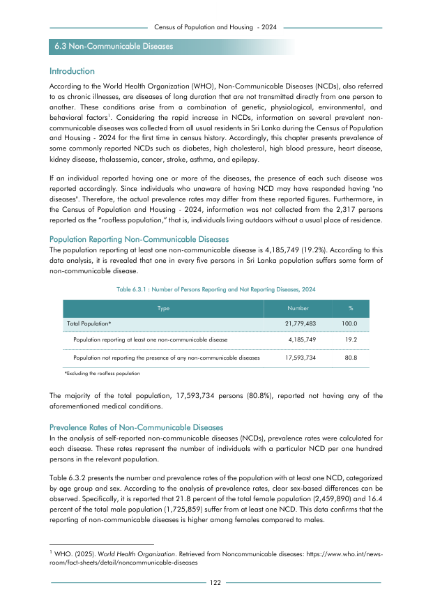

# Number of Persons Reporting and Not Reporting Diseases, 2024


*Table 6.3.1, Final Report, 2024 Census of Population and Housing, Department of Census and Statistics, Sri Lanka*

## Raw Data (directly scraped from PDF)

```json
[
    [
        "6.3 Non-Communicable Diseases",
        ""
    ],
    [
        "I\nntroduction",
        ""
    ],
    [
        "According to the World Health Organization (WHO), Non-Communicable Diseases (NCDs), also referred",
        ""
    ],
    [
        "to as chronic illnesses, are diseases of long duration that are not transmitted directly from one person to",
        ""
    ],
    [
        "another.  These  conditions  arise",
        "from  a  combination  of  genetic,  physiological,  environmental,  and"
    ],
    [
        "behavioral  factors1.  Considering  the  rapid  increase  in  NCDs,  information  on  several  prevalent  non-",
        ""
    ],
    [
        "communicable diseases was collected from all usual residents in Sri Lanka during the Census of Population",
        ""
    ],
    [
...
```
- Source File: [raw_data.json (2.1 KB)](../../../../data/final-report-tables/chapter-6/6.3.1-Number-of-Persons-Reporting-and-Not-Reporting-Diseases-2024/raw_data.json)

## Original PDF Page



- Source File: [original.pdf (73.1 KB)](../../../../data/final-report-tables/chapter-6/6.3.1-Number-of-Persons-Reporting-and-Not-Reporting-Diseases-2024/original.pdf)

## Source

- <https://www.statistics.gov.lk/Resource/en/Population/CPH_2024/CPH2024_Final_Eng.pdf#page=139>


[](https://opensource.org/licenses/MIT)
