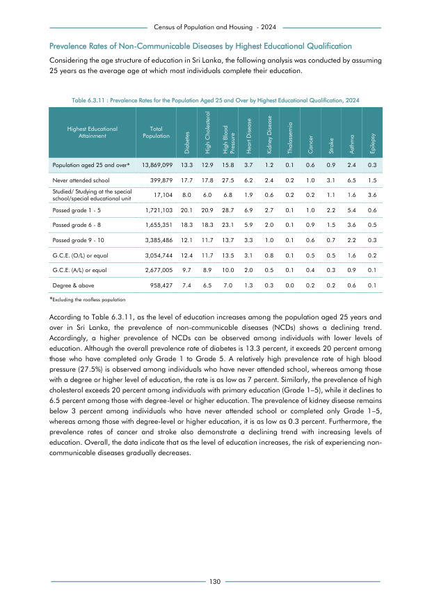

# Prevalence Rates for the Population Aged 25 and Over by Highest Educational Qualification, 2024


*Table 6.3.11, Final Report, 2024 Census of Population and Housing, Department of Census and Statistics, Sri Lanka*

## Structured Data (similar to original layout)

```json
[
    {
        "education": "Population aged 25 and over*",
        "values": {
            "p_diabetes": 0.133,
            "p_high_cholesterol": 0.129,
            "p_high_blood_pressure": 0.158,
            "p_heart_disease": 0.037,
            "p_kidney_disease": 0.012,
            "p_thalassemia": 0.001,
            "p_cancer": 0.006,
            "p_stroke": 0.009,
            "p_asthma": 0.024,
            "p_epilepsy": 0.003
        }
    },
    {
        "education": "Never attended school",
        "values": {
            "p_diabetes": 0.177,
            "p_high_cholesterol": 0.178,
            "p_high_blood_pressure": 0.275,
            "p_heart_disease": 0.062,
            "p_kidney_disease": 0.024,
            "p_thalassemia": 0.002,
            "p_cancer": 0.01,
            "p_stroke": 0.031,
            "p_asthma": 0.065,
            "p_epilepsy": 0.015
        }
...
```

- Source File: [data.json (3.3 KB)](../../../../data/final-report-tables/chapter-6/6.3.11-Prevalence-Rates-for-the-Population-Aged-25-and-Over-by-Highest-Educational-Qualification,-2024/data.json)

## Raw Data (directly scraped from PDF)

```json
[
    [
        "Attainment",
        "Population",
        "Diabetes",
        "High Cholesterol",
        "High Blood \nPressure",
        "Heart Disease",
        "Kidney Disease",
        "Thalassemia",
        "Cancer",
        "Stroke",
        "Asthma",
        "Epilepsy"
    ],
    [
        "Population aged 25 and over*",
        "13,869,099",
        "13.3",
        "12.9",
        "15.8",
        "3.7",
        "1.2",
        "0.1",
        "0.6",
        "0.9",
        "2.4",
        "0.3"
    ],
    [
...
```
- Source File: [raw_data.json (1.7 KB)](../../../../data/final-report-tables/chapter-6/6.3.11-Prevalence-Rates-for-the-Population-Aged-25-and-Over-by-Highest-Educational-Qualification,-2024/raw_data.json)

## Original PDF Page



- Source File: [original.pdf (61.9 KB)](../../../../data/final-report-tables/chapter-6/6.3.11-Prevalence-Rates-for-the-Population-Aged-25-and-Over-by-Highest-Educational-Qualification,-2024/original.pdf)

## Source

- <https://www.statistics.gov.lk/Resource/en/Population/CPH_2024/CPH2024_Final_Eng.pdf#page=147>


[](https://opensource.org/licenses/MIT)
