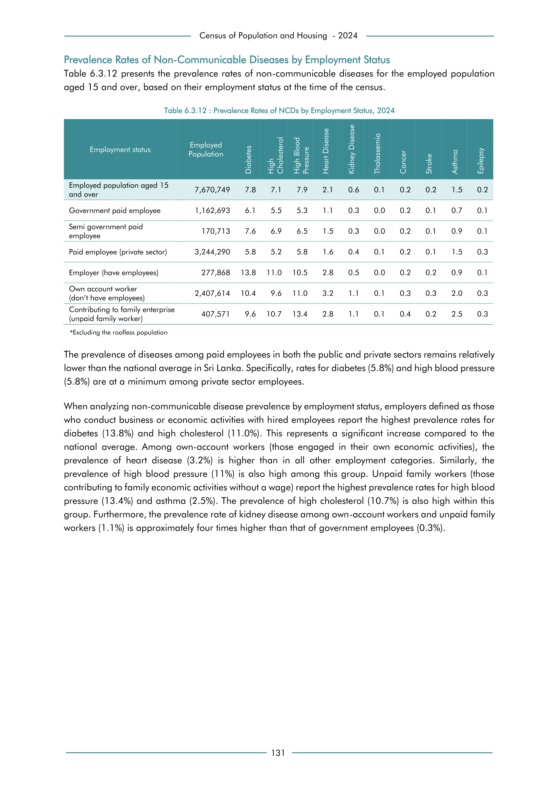

# Prevalence Rates of NCDs by Employment Status, 2024


*Table 6.3.12, Final Report, 2024 Census of Population and Housing, Department of Census and Statistics, Sri Lanka*

## Structured Data (similar to original layout)

```json
[
    {
        "employment_status": "Employed population aged 15  and over",
        "values": {
            "p_diabetes": 0.078,
            "p_high_cholesterol": 0.071,
            "p_high_blood_pressure": 0.079,
            "p_heart_disease": 0.021,
            "p_kidney_disease": 0.006,
            "p_thalassemia": 0.001,
            "p_cancer": 0.002,
            "p_stroke": 0.002,
            "p_asthma": 0.015,
            "p_epilepsy": 0.002
        }
    },
    {
        "employment_status": "Government paid employee",
        "values": {
            "p_diabetes": 0.061,
            "p_high_cholesterol": 0.055,
            "p_high_blood_pressure": 0.053,
            "p_heart_disease": 0.011,
            "p_kidney_disease": 0.003,
            "p_thalassemia": 0.0,
            "p_cancer": 0.002,
            "p_stroke": 0.001,
            "p_asthma": 0.007,
            "p_epilepsy": 0.001
        }
...
```

- Source File: [data.json (2.7 kB)](../../../../data/final-report-tables/chapter-6/6.3.12-Prevalence-Rates-of-NCDs-by-Employment-Status,-2024/data.json)

## Raw Data (directly scraped from PDF)

```json
[
    [
        "",
        "Employment status",
        "Employed \nPopulation",
        "Diabetes",
        "High \nCholesterol",
        "High Blood \nPressure",
        "Heart Disease",
        "Kidney Disease",
        "Thalassemia",
        "Cancer",
        "Stroke",
        "Asthma",
        "Epilepsy"
    ],
    [
        "",
        "Employed population aged 15 \nand over",
        "7,670,749",
        "7.8",
        "7.1",
        "7.9",
        "2.1",
        "0.6",
        "0.1",
        "0.2",
        "0.2",
        "1.5",
        "0.2"
...
```
- Source File: [raw_data.json (2.2 kB)](../../../../data/final-report-tables/chapter-6/6.3.12-Prevalence-Rates-of-NCDs-by-Employment-Status,-2024/raw_data.json)

## Original PDF Page



- Source File: [original.pdf (54.6 kB)](../../../../data/final-report-tables/chapter-6/6.3.12-Prevalence-Rates-of-NCDs-by-Employment-Status,-2024/original.pdf)

## Source

- <https://www.statistics.gov.lk/Resource/en/Population/CPH_2024/CPH2024_Final_Eng.pdf#page=148>


[](https://opensource.org/licenses/MIT)
