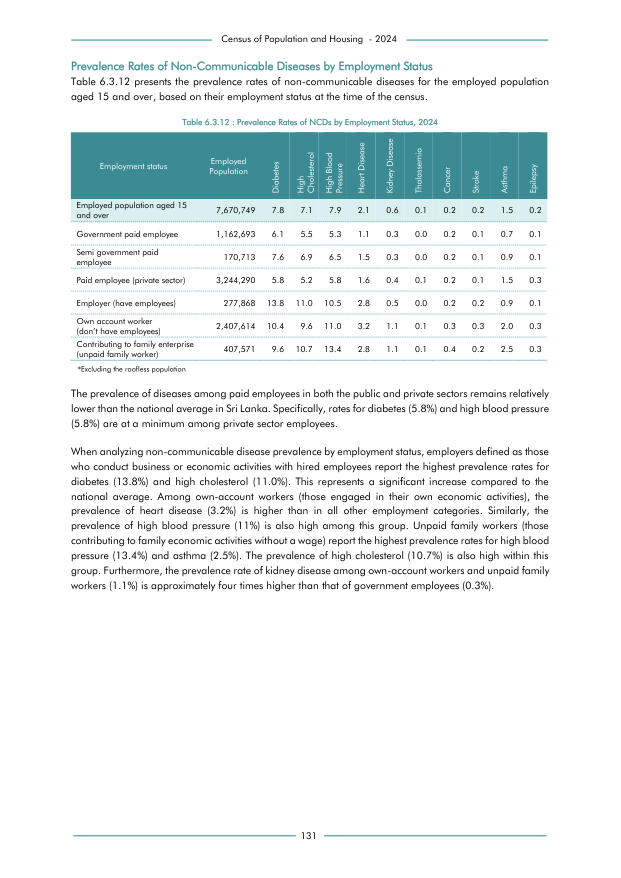

# Prevalence Rates of NCDs by Employment Status, 2024


*Table 6.3.12, Final Report, 2024 Census of Population and Housing, Department of Census and Statistics, Sri Lanka*

## Structured Data formatted for [Lanka Data API](https://github.com/nuuuwan/lanka_data)

```json
{
    "Person": {
        "Time:2024": {
            "EmploymentStatus:govt_employee": {
                "NonCommunicableDisease:diabetes": {
                    "Count": "Int:70924"
                },
                "NonCommunicableDisease:high_cholesterol": {
                    "Count": "Int:63948"
                },
                "NonCommunicableDisease:high_blood_pressure": {
                    "Count": "Int:61623"
                },
                "NonCommunicableDisease:heart_disease": {
                    "Count": "Int:12790"
                },
                "NonCommunicableDisease:kidney_disease": {
                    "Count": "Int:3488"
                },
                "NonCommunicableDisease:thalassemia": {
                    "Count": "Int:0"
                },
                "NonCommunicableDisease:cancer": {
                    "Count": "Int:2325"
                },
                "NonCommunicableDisease:stroke_or_paralysis": {
                    "Count": "Int:1163"
                },
                "NonCommunicableDisease:asthma": {
                    "Count": "Int:8139"
...
```

- Source File: [lanka_data.json (5.6 KB)](../../../../data/final-report-tables/chapter-6/6.3.12-Prevalence-Rates-of-NCDs-by-Employment-Status-2024/lanka_data.json)

## Structured Data (similar to original layout)

```json
[
    {
        "employment_status": "Employed population aged 15  and over",
        "values": {
            "diabetes": 598318,
            "high_cholesterol": 544623,
            "high_blood_pressure": 605989,
            "heart_disease": 161086,
            "kidney_disease": 46024,
            "thalassemia": 7671,
            "cancer": 15341,
            "stroke": 15341,
            "asthma": 115061,
            "epilepsy": 15341
        },
        "total_value": 7670749
    },
    {
        "employment_status": "Government paid employee",
        "values": {
            "diabetes": 70924,
            "high_cholesterol": 63948,
            "high_blood_pressure": 61623,
            "heart_disease": 12790,
            "kidney_disease": 3488,
            "thalassemia": 0,
            "cancer": 2325,
            "stroke": 1163,
            "asthma": 8139,
            "epilepsy": 1163
...
```

- Source File: [data.json (2.7 KB)](../../../../data/final-report-tables/chapter-6/6.3.12-Prevalence-Rates-of-NCDs-by-Employment-Status-2024/data.json)

## Raw Data (directly scraped from PDF)

```json
[
    [
        "",
        "Employment status",
        "Employed \nPopulation",
        "Diabetes",
        "High \nCholesterol",
        "High Blood \nPressure",
        "Heart Disease",
        "Kidney Disease",
        "Thalassemia",
        "Cancer",
        "Stroke",
        "Asthma",
        "Epilepsy"
    ],
    [
        "",
        "Employed population aged 15 \nand over",
        "7,670,749",
        "7.8",
        "7.1",
        "7.9",
        "2.1",
        "0.6",
        "0.1",
        "0.2",
        "0.2",
        "1.5",
        "0.2"
...
```
- Source File: [raw_data.json (2.1 KB)](../../../../data/final-report-tables/chapter-6/6.3.12-Prevalence-Rates-of-NCDs-by-Employment-Status-2024/raw_data.json)

## Original PDF Page



- Source File: [original.pdf (53.3 KB)](../../../../data/final-report-tables/chapter-6/6.3.12-Prevalence-Rates-of-NCDs-by-Employment-Status-2024/original.pdf)

## Source

- <https://www.statistics.gov.lk/Resource/en/Population/CPH_2024/CPH2024_Final_Eng.pdf#page=148>


[](https://opensource.org/licenses/MIT)
