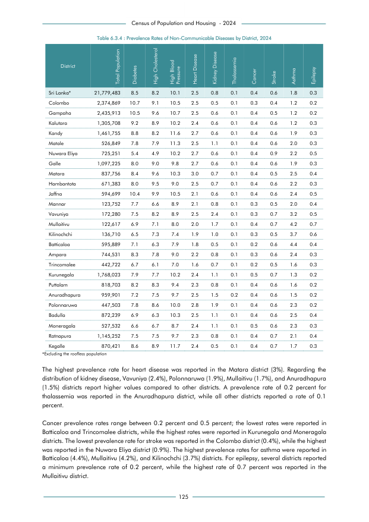

# Prevalence Rates of Non-Communicable Diseases by District, 2024


*Table 6.3.4, Final Report, 2024 Census of Population and Housing, Department of Census and Statistics, Sri Lanka*

## Structured Data formatted for [Lanka Data API](https://github.com/nuuuwan/lanka_data)

```json
{
    "Person": {
        "Time:2024": {
            "District:colombo": {
                "NonCommunicableDisease:diabetes": {
                    "Count": "Int:254111"
                },
                "NonCommunicableDisease:high_cholesterol": {
                    "Count": "Int:216113"
                },
                "NonCommunicableDisease:high_blood_pressure": {
                    "Count": "Int:249361"
                },
                "NonCommunicableDisease:heart_disease": {
                    "Count": "Int:59372"
                },
                "NonCommunicableDisease:kidney_disease": {
                    "Count": "Int:11874"
                },
                "NonCommunicableDisease:thalassemia": {
                    "Count": "Int:2375"
                },
                "NonCommunicableDisease:cancer": {
                    "Count": "Int:7125"
                },
                "NonCommunicableDisease:stroke_or_paralysis": {
                    "Count": "Int:9499"
                },
                "NonCommunicableDisease:asthma": {
                    "Count": "Int:28498"
...
```

- Source File: [lanka_data.json (23.0 KB)](../../../../data/final-report-tables/chapter-6/6.3.4-Prevalence-Rates-of-Non-Communicable-Diseases-by-District-2024/lanka_data.json)

## Structured Data (similar to original layout)

```json
[
    {
        "region_id": "LK-11",
        "region_name": "Colombo",
        "region_ent_type": "district",
        "values": {
            "diabetes": 254111,
            "high_cholesterol": 216113,
            "high_blood_pressure": 249361,
            "heart_disease": 59372,
            "kidney_disease": 11874,
            "thalassemia": 2375,
            "cancer": 7125,
            "stroke": 9499,
            "asthma": 28498,
            "epilepsy": 4750
        },
        "total_value": 2374869
    },
    {
        "region_id": "LK-12",
        "region_name": "Gampaha",
        "region_ent_type": "district",
        "values": {
            "diabetes": 255771,
            "high_cholesterol": 233848,
            "high_blood_pressure": 260643,
            "heart_disease": 60898,
            "kidney_disease": 14615,
            "thalassemia": 2436,
...
```

- Source File: [data.json (24.6 KB)](../../../../data/final-report-tables/chapter-6/6.3.4-Prevalence-Rates-of-Non-Communicable-Diseases-by-District-2024/data.json)

## Raw Data (directly scraped from PDF)

```json
[
    [
        "District",
        "Total Population",
        "Diabetes",
        "High Cholesterol",
        "High Blood \nPressure",
        "Heart Disease",
        "Kidney Disease",
        "Thalassemia",
        "Cancer",
        "Stroke",
        "Asthma",
        "Epilepsy"
    ],
    [
        "Sri Lanka*",
        "21,779,483",
        "8.5",
        "8.2",
        "10.1",
        "2.5",
        "0.8",
        "0.1",
        "0.4",
        "0.6",
        "1.8",
        "0.3"
    ],
    [
...
```
- Source File: [raw_data.json (7.1 KB)](../../../../data/final-report-tables/chapter-6/6.3.4-Prevalence-Rates-of-Non-Communicable-Diseases-by-District-2024/raw_data.json)

## Original PDF Page



- Source File: [original.pdf (66.5 KB)](../../../../data/final-report-tables/chapter-6/6.3.4-Prevalence-Rates-of-Non-Communicable-Diseases-by-District-2024/original.pdf)

## Source

- <https://www.statistics.gov.lk/Resource/en/Population/CPH_2024/CPH2024_Final_Eng.pdf#page=142>


[](https://opensource.org/licenses/MIT)
