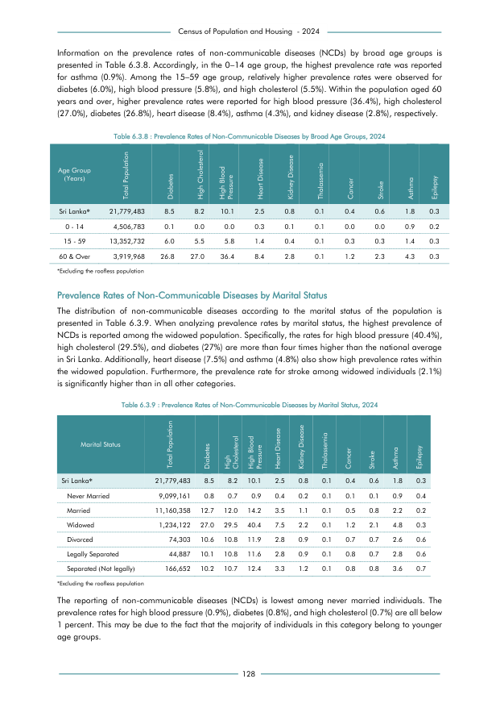

# Prevalence Rates of Non-Communicable Diseases by Marital Status, 2024


*Table 6.3.9, Final Report, 2024 Census of Population and Housing, Department of Census and Statistics, Sri Lanka*

## Structured Data formatted for [Lanka Data API](https://github.com/nuuuwan/lanka_data)

```json
{
    "Person": {
        "Time:2024": {
            "MaritalStatus:never_married": {
                "NonCommunicableDisease:diabetes": {
                    "Count": "Int:72793"
                },
                "NonCommunicableDisease:high_cholesterol": {
                    "Count": "Int:63694"
                },
                "NonCommunicableDisease:high_blood_pressure": {
                    "Count": "Int:81892"
                },
                "NonCommunicableDisease:heart_disease": {
                    "Count": "Int:36397"
                },
                "NonCommunicableDisease:kidney_disease": {
                    "Count": "Int:18198"
                },
                "NonCommunicableDisease:thalassemia": {
                    "Count": "Int:9099"
                },
                "NonCommunicableDisease:cancer": {
                    "Count": "Int:9099"
                },
                "NonCommunicableDisease:stroke_or_paralysis": {
                    "Count": "Int:9099"
                },
                "NonCommunicableDisease:asthma": {
                    "Count": "Int:81892"
...
```

- Source File: [lanka_data.json (5.6 KB)](../../../../data/final-report-tables/chapter-6/6.3.9-Prevalence-Rates-of-Non-Communicable-Diseases-by-Marital-Status-2024/lanka_data.json)

## Structured Data (similar to original layout)

```json
[
    {
        "marital_status": "Sri Lanka*",
        "values": {
            "diabetes": 1851256,
            "high_cholesterol": 1785918,
            "high_blood_pressure": 2199728,
            "heart_disease": 544487,
            "kidney_disease": 174236,
            "thalassemia": 21779,
            "cancer": 87118,
            "stroke": 130677,
            "asthma": 392031,
            "epilepsy": 65338
        },
        "total_value": 21779483
    },
    {
        "marital_status": "Never Married",
        "values": {
            "diabetes": 72793,
            "high_cholesterol": 63694,
            "high_blood_pressure": 81892,
            "heart_disease": 36397,
            "kidney_disease": 18198,
            "thalassemia": 9099,
            "cancer": 9099,
            "stroke": 9099,
            "asthma": 81892,
            "epilepsy": 36397
...
```

- Source File: [data.json (2.5 KB)](../../../../data/final-report-tables/chapter-6/6.3.9-Prevalence-Rates-of-Non-Communicable-Diseases-by-Marital-Status-2024/data.json)

## Raw Data (directly scraped from PDF)

```json
[
    [
        "Marital Status",
        "Total Population",
        "Diabetes",
        "High \nCholesterol",
        "High Blood \nPressure",
        "Heart Disease",
        "Kidney Disease",
        "Thalassemia",
        "Cancer",
        "Stroke",
        "Asthma",
        "Epilepsy"
    ],
    [
        "Sri Lanka*",
        "21,779,483",
        "8.5",
        "8.2",
        "10.1",
        "2.5",
        "0.8",
        "0.1",
        "0.4",
        "0.6",
        "1.8",
        "0.3"
    ],
    [
...
```
- Source File: [raw_data.json (1.3 KB)](../../../../data/final-report-tables/chapter-6/6.3.9-Prevalence-Rates-of-Non-Communicable-Diseases-by-Marital-Status-2024/raw_data.json)

## Original PDF Page



- Source File: [original.pdf (90.9 KB)](../../../../data/final-report-tables/chapter-6/6.3.9-Prevalence-Rates-of-Non-Communicable-Diseases-by-Marital-Status-2024/original.pdf)

(Table 1 on this page.)

## Source

- <https://www.statistics.gov.lk/Resource/en/Population/CPH_2024/CPH2024_Final_Eng.pdf#page=145>


[](https://opensource.org/licenses/MIT)
