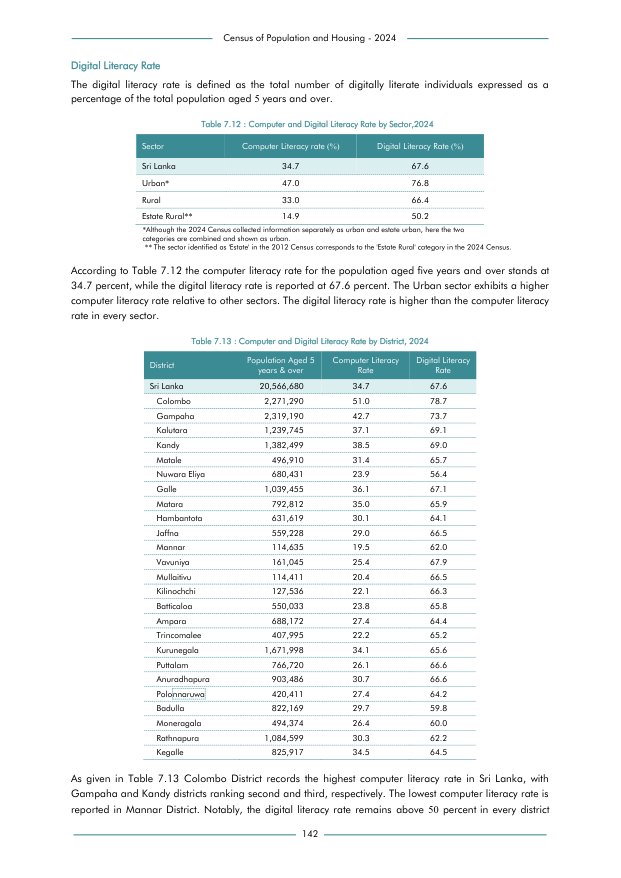

# Computer and Digital Literacy Rate by Sector,2024


*Table 7.12, Final Report, 2024 Census of Population and Housing, Department of Census and Statistics, Sri Lanka*

## Structured Data (similar to original layout)

```json
[
    {
        "sector": "Sri Lanka",
        "values": {
            "computer_literacy_rate": 34.7,
            "digital_literacy_rate": 67.6
        }
    },
    {
        "sector": "Urban*",
        "values": {
            "computer_literacy_rate": 47.0,
            "digital_literacy_rate": 76.8
        }
    },
    {
        "sector": "Rural",
        "values": {
            "computer_literacy_rate": 33.0,
            "digital_literacy_rate": 66.4
        }
    },
    {
        "sector": "Estate Rural**",
        "values": {
            "computer_literacy_rate": 14.9,
            "digital_literacy_rate": 50.2
        }
    }
]
```

- Source File: [data.json (528.0 B)](../../../../data/final-report-tables/chapter-7/7.12-Computer-and-Digital-Literacy-Rate-by-Sector-2024/data.json)

## Raw Data (directly scraped from PDF)

```json
[
    [
        "percentage of the total population aged 5 years and over.",
        "",
        ""
    ],
    [
        "",
        "Table 7.12 : Computer and Digital Literacy Rate by Sector,2024",
        ""
    ],
    [
        "Sector",
        "Computer Literacy rate (%)",
        "Digital Literacy Rate (%)"
    ],
    [
        "Sri Lanka",
        "34.7",
        "67.6"
    ],
    [
        "Urban*",
        "47.0",
        "76.8"
    ],
    [
        "Rural",
        "33.0",
        "66.4"
...
```
- Source File: [raw_data.json (795.0 B)](../../../../data/final-report-tables/chapter-7/7.12-Computer-and-Digital-Literacy-Rate-by-Sector-2024/raw_data.json)

## Original PDF Page



- Source File: [original.pdf (60.6 KB)](../../../../data/final-report-tables/chapter-7/7.12-Computer-and-Digital-Literacy-Rate-by-Sector-2024/original.pdf)

(Table 0 on this page.)

## Source

- <https://www.statistics.gov.lk/Resource/en/Population/CPH_2024/CPH2024_Final_Eng.pdf#page=159>


[](https://opensource.org/licenses/MIT)
