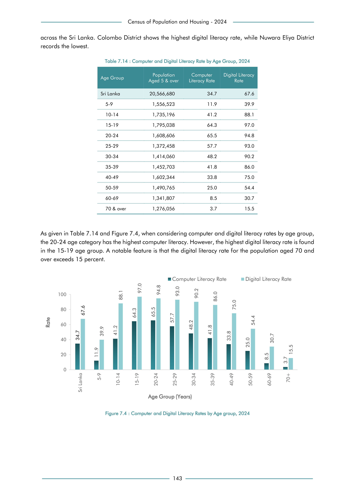

# Computer and Digital Literacy Rate by Age Group,


*Table 7.14, Final Report, 2024 Census of Population and Housing, Department of Census and Statistics, Sri Lanka*

## Structured Data (similar to original layout)

```json
[
    {
        "null": "Sri Lanka",
        "values": {
            "population_aged_5_or_over": 20566680,
            "p_computer_literacy_rate": 0.347,
            "p_digital_literacy_rate": 0.676
        }
    },
    {
        "null": "5-9",
        "values": {
            "population_aged_5_or_over": 1556523,
            "p_computer_literacy_rate": 0.119,
            "p_digital_literacy_rate": 0.399
        }
    },
    {
        "null": "10-14",
        "values": {
            "population_aged_5_or_over": 1735196,
            "p_computer_literacy_rate": 0.412,
            "p_digital_literacy_rate": 0.881
        }
    },
    {
        "null": "15-19",
        "values": {
            "population_aged_5_or_over": 1795038,
            "p_computer_literacy_rate": 0.643,
...
```

- Source File: [data.json (2.1 kB)](../../../../data/final-report-tables/chapter-7/7.14-Computer-and-Digital-Literacy-Rate-by-Age-Group,/data.json)

## Raw Data (directly scraped from PDF)

```json
[
    [
        "",
        "Table 7.14 : Computer and Digital Literacy Rate by Age Group, 2024",
        "",
        ""
    ],
    [
        "Age Group",
        "Population \nAged 5 & over",
        "Computer \nLiteracy Rate",
        "Digital Literacy \nRate"
    ],
    [
        "Sri Lanka",
        "20,566,680",
        "34.7",
        "67.6"
    ],
    [
        "5-9",
        "1,556,523",
        "11.9",
        "39.9"
    ],
    [
        "10-14",
        "1,735,196",
        "41.2",
        "88.1"
...
```
- Source File: [raw_data.json (1.1 kB)](../../../../data/final-report-tables/chapter-7/7.14-Computer-and-Digital-Literacy-Rate-by-Age-Group,/raw_data.json)

## Original PDF Page



- Source File: [original.pdf (67.1 kB)](../../../../data/final-report-tables/chapter-7/7.14-Computer-and-Digital-Literacy-Rate-by-Age-Group,/original.pdf)

## Source

- <https://www.statistics.gov.lk/Resource/en/Population/CPH_2024/CPH2024_Final_Eng.pdf#page=160>


[](https://opensource.org/licenses/MIT)
