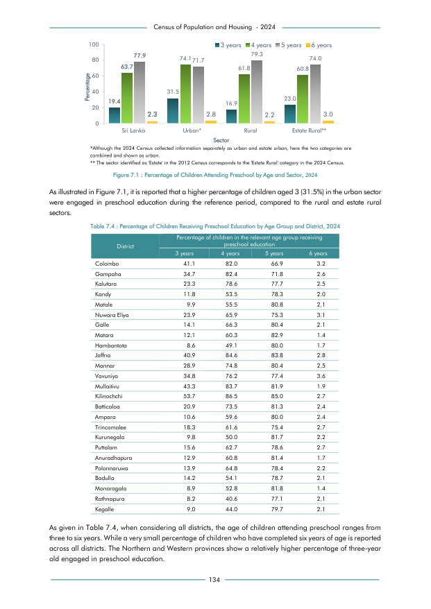

# Percentage of Children Receiving Preschool Education by Age Group and District, 2024


*Table 7.4, Final Report, 2024 Census of Population and Housing, Department of Census and Statistics, Sri Lanka*

## Structured Data formatted for [Lanka Data API](https://github.com/nuuuwan/lanka_data)

```json
{
    "Person": {
        "Time:2024": {
            "District:colombo": {
                "AgeGroup:3To3Years": {
                    "PercentInPreschool": "Percent:0.411"
                },
                "AgeGroup:4To4Years": {
                    "PercentInPreschool": "Percent:0.82"
                },
                "AgeGroup:5To5Years": {
                    "PercentInPreschool": "Percent:0.669"
                },
                "AgeGroup:6To6Years": {
                    "PercentInPreschool": "Percent:0.032"
                }
            },
            "District:gampaha": {
                "AgeGroup:3To3Years": {
                    "PercentInPreschool": "Percent:0.347"
                },
                "AgeGroup:4To4Years": {
                    "PercentInPreschool": "Percent:0.824"
                },
                "AgeGroup:5To5Years": {
                    "PercentInPreschool": "Percent:0.718"
                },
                "AgeGroup:6To6Years": {
                    "PercentInPreschool": "Percent:0.026"
                }
...
```

- Source File: [lanka_data.json (9.8 KB)](../../../../data/final-report-tables/chapter-7/7.4-Percentage-of-Children-Receiving-Preschool-Education-by-Age-Group-and-District-2024/lanka_data.json)

## Structured Data (similar to original layout)

```json
[
    {
        "region_id": "LK-11",
        "region_name": "Colombo",
        "region_ent_type": "district",
        "values": {
            "p_3_years": 0.411,
            "p_4_years": 0.82,
            "p_5_years": 0.669,
            "p_6_years": 0.032
        }
    },
    {
        "region_id": "LK-12",
        "region_name": "Gampaha",
        "region_ent_type": "district",
        "values": {
            "p_3_years": 0.347,
            "p_4_years": 0.824,
            "p_5_years": 0.718,
            "p_6_years": 0.026
        }
    },
    {
        "region_id": "LK-13",
        "region_name": "Kalutara",
        "region_ent_type": "district",
        "values": {
            "p_3_years": 0.233,
            "p_4_years": 0.786,
...
```

- Source File: [data.json (5.5 KB)](../../../../data/final-report-tables/chapter-7/7.4-Percentage-of-Children-Receiving-Preschool-Education-by-Age-Group-and-District-2024/data.json)

## Raw Data (directly scraped from PDF)

```json
[
    [
        "",
        "",
        "",
        "",
        "Census of Population and Housing  - 2024",
        "",
        "",
        "",
        "",
        "",
        "",
        "",
        ""
    ],
    [
        "100",
        "",
        "",
        "",
        "",
        "",
        "",
        "3 years",
        "",
        "4 years",
        "5 years",
        "",
        "6 years"
...
```
- Source File: [raw_data.json (3.1 KB)](../../../../data/final-report-tables/chapter-7/7.4-Percentage-of-Children-Receiving-Preschool-Education-by-Age-Group-and-District-2024/raw_data.json)

## Original PDF Page



- Source File: [original.pdf (71.4 KB)](../../../../data/final-report-tables/chapter-7/7.4-Percentage-of-Children-Receiving-Preschool-Education-by-Age-Group-and-District-2024/original.pdf)

## Source

- <https://www.statistics.gov.lk/Resource/en/Population/CPH_2024/CPH2024_Final_Eng.pdf#page=151>


[](https://opensource.org/licenses/MIT)
