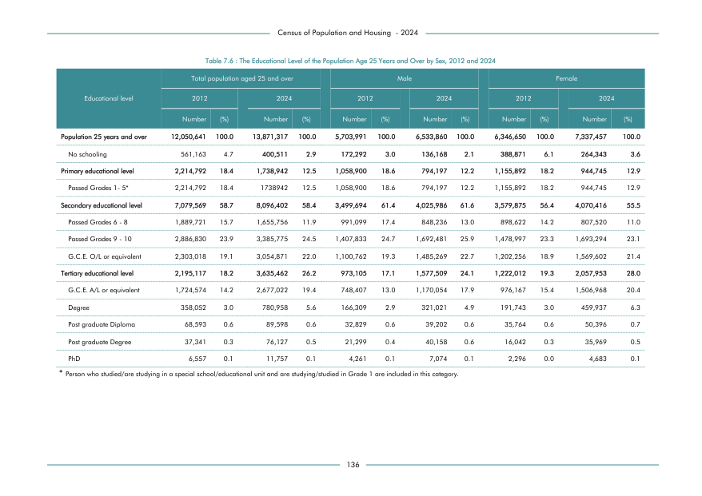

# The Educational Level of the Population Age 25 Years and Over by Sex, 2012 and 2024


*Table 7.6, Final Report, 2024 Census of Population and Housing, Department of Census and Statistics, Sri Lanka*

## Raw Data (directly scraped from PDF)

```json
[
    [
        "Educational level",
        "2012",
        "",
        "2024",
        "",
        "2012",
        "",
        "2024",
        "",
        "2012",
        "",
        "2024",
        ""
    ],
    [
        "",
        "Number",
        "(%)",
        "Number",
        "(%)",
        "Number",
        "(%)",
        "Number",
        "(%)",
        "Number",
        "(%)",
        "Number",
        "(%)"
...
```
- Source File: [raw_data.json (3.1 kB)](../../../../data/final-report-tables/chapter-7/7.6-The-Educational-Level-of-the-Population-Age-25-Years-and-Over-by-Sex,-2012-and-2024/raw_data.json)

## Original PDF Page



- Source File: [original.pdf (64.5 kB)](../../../../data/final-report-tables/chapter-7/7.6-The-Educational-Level-of-the-Population-Age-25-Years-and-Over-by-Sex,-2012-and-2024/original.pdf)

## Source

- <https://www.statistics.gov.lk/Resource/en/Population/CPH_2024/CPH2024_Final_Eng.pdf#page=153>


[](https://opensource.org/licenses/MIT)
