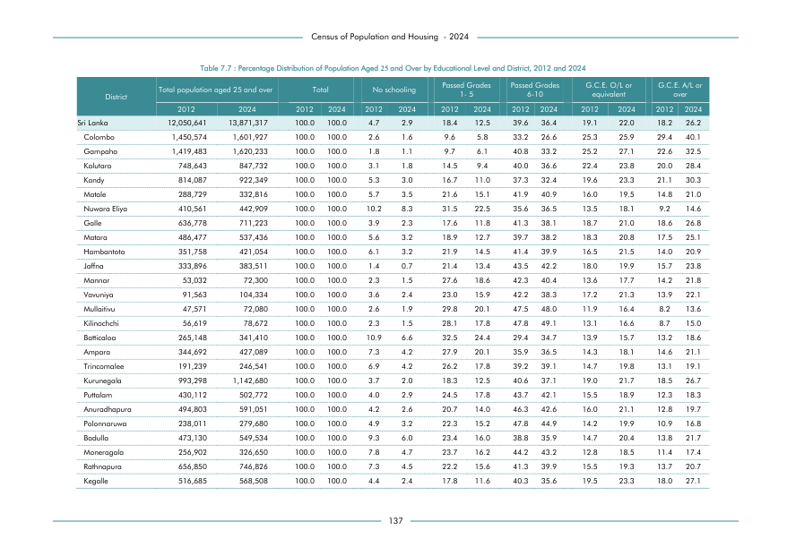

# Percentage Distribution of Population Aged 25 and Over by Educational Level and District, 2012 and 2024


*Table 7.7, Final Report, 2024 Census of Population and Housing, Department of Census and Statistics, Sri Lanka*

## Structured Data (similar to original layout)

```json
[
    {
        "region_id": "LK-11",
        "region_name": "Colombo",
        "region_ent_type": "district",
        "values": {
            "total_value_2012": 1450574,
            "total_value_2024": 1601927,
            "p_no_schooling_2012": 0.026,
            "p_no_schooling_2024": 0.016,
            "p_passed_1_5_years_2012": 0.096,
            "p_passed_1_5_years_2024": 0.058,
            "p_passed_6_10_years_2012": 0.332,
            "p_passed_6_10_years_2024": 0.266,
            "p_gce_ol_2012": 0.253,
            "p_gce_ol_2024": 0.259,
            "p_gce_al_2012": 0.294,
            "p_gce_al_2024": 0.401
        }
    },
    {
        "region_id": "LK-12",
        "region_name": "Gampaha",
        "region_ent_type": "district",
        "values": {
            "total_value_2012": 1419483,
            "total_value_2024": 1620233,
            "p_no_schooling_2012": 0.018,
            "p_no_schooling_2024": 0.011,
            "p_passed_1_5_years_2012": 0.097,
...
```

- Source File: [data.json (13.3 KB)](../../../../data/final-report-tables/chapter-7/7.7-Percentage-Distribution-of-Population-Aged-25-and-Over-by-Educational-Level-and-District-2012-and-2024/data.json)

## Raw Data (directly scraped from PDF)

```json
[
    [
        "",
        "",
        "Table 7.7 : Percentage Distribution of Population Aged 25 and Over by Educational Level and District, 2012 and 2024",
        "",
        "",
        "",
        "",
        "",
        "",
        "",
        "",
        "",
        "",
        "",
        ""
    ],
    [
        "",
        "",
        "Total population aged 25 and over",
        "",
        "Total",
        "",
        "No schooling",
        "",
        "Passed Grades  \n1- 5",
        "Passed Grades",
        "6-10",
...
```
- Source File: [raw_data.json (5.9 KB)](../../../../data/final-report-tables/chapter-7/7.7-Percentage-Distribution-of-Population-Aged-25-and-Over-by-Educational-Level-and-District-2012-and-2024/raw_data.json)

## Original PDF Page



- Source File: [original.pdf (76.1 KB)](../../../../data/final-report-tables/chapter-7/7.7-Percentage-Distribution-of-Population-Aged-25-and-Over-by-Educational-Level-and-District-2012-and-2024/original.pdf)

## Source

- <https://www.statistics.gov.lk/Resource/en/Population/CPH_2024/CPH2024_Final_Eng.pdf#page=154>


[](https://opensource.org/licenses/MIT)
