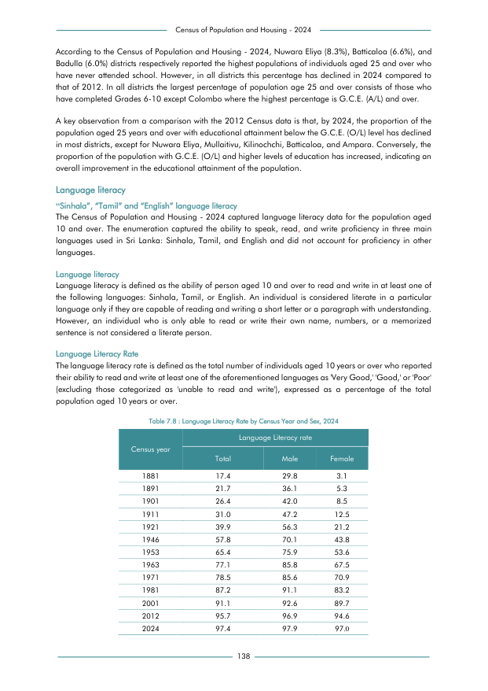

# Language Literacy Rate by Census Year and Sex, 2024


*Table 7.8, Final Report, 2024 Census of Population and Housing, Department of Census and Statistics, Sri Lanka*

## Structured Data (similar to original layout)

```json
[
    {
        "census_year": "1881",
        "values": {
            "p_total_literacy_rate": 0.174,
            "p_male_literacy_rate": 0.298,
            "p_female_literacy_rate": 0.031
        }
    },
    {
        "census_year": "1891",
        "values": {
            "p_total_literacy_rate": 0.217,
            "p_male_literacy_rate": 0.361,
            "p_female_literacy_rate": 0.053
        }
    },
    {
        "census_year": "1901",
        "values": {
            "p_total_literacy_rate": 0.264,
            "p_male_literacy_rate": 0.42,
            "p_female_literacy_rate": 0.085
        }
    },
    {
        "census_year": "1911",
        "values": {
            "p_total_literacy_rate": 0.31,
            "p_male_literacy_rate": 0.472,
...
```

- Source File: [data.json (2.2 KB)](../../../../data/final-report-tables/chapter-7/7.8-Language-Literacy-Rate-by-Census-Year-and-Sex-2024/data.json)

## Raw Data (directly scraped from PDF)

```json
[
    [
        "Census of Population and Housing - 2024"
    ],
    [
        "According to the Census of Population and Housing - 2024, Nuwara Eliya (8.3%), Batticaloa (6.6%), and"
    ],
    [
        "Badulla (6.0%) districts respectively reported the highest populations of individuals aged 25 and over who"
    ],
    [
        "have never attended school. However, in all districts this percentage has declined in 2024 compared to"
    ],
    [
        "that of 2012. In all districts the largest percentage of population age 25 and  over consists of those who"
    ],
    [
        "have completed Grades 6-10 except Colombo where the highest percentage is G.C.E. (A/L) and over."
    ],
    [
        "A key observation from a comparison with the 2012 Census data is that, by 2024, the proportion of the"
    ],
    [
        "population aged 25 years and over with educational attainment below the G.C.E. (O/L) level has declined"
    ],
    [
        "in most districts, except for Nuwara Eliya, Mullaitivu, Kilinochchi, Batticaloa, and Ampara. Conversely, the"
    ],
    [
        "proportion of the population with G.C.E. (O/L) and higher levels of education has increased, indicating an"
...
```
- Source File: [raw_data.json (3.7 KB)](../../../../data/final-report-tables/chapter-7/7.8-Language-Literacy-Rate-by-Census-Year-and-Sex-2024/raw_data.json)

## Original PDF Page



- Source File: [original.pdf (57.9 KB)](../../../../data/final-report-tables/chapter-7/7.8-Language-Literacy-Rate-by-Census-Year-and-Sex-2024/original.pdf)

## Source

- <https://www.statistics.gov.lk/Resource/en/Population/CPH_2024/CPH2024_Final_Eng.pdf#page=155>


[](https://opensource.org/licenses/MIT)
