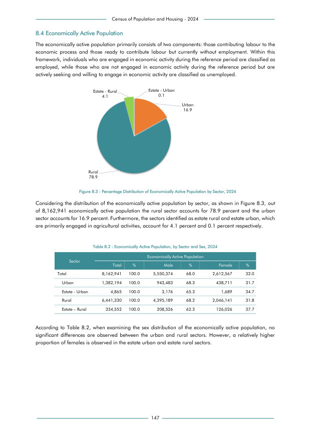

# Economically Active Population, by Sector and Sex, 2024


*Table 8.2, Final Report, 2024 Census of Population and Housing, Department of Census and Statistics, Sri Lanka*

## Structured Data formatted for [Lanka Data API](https://github.com/nuuuwan/lanka_data)

```json
{
    "Person": {
        "Time:2024": {
            "Sector:urban": {
                "Sex:male": {
                    "Count": "Int:943483"
                },
                "Sex:female": {
                    "Count": "Int:438711"
                }
            },
            "Sector:estate_urban": {
                "Sex:male": {
                    "Count": "Int:3176"
                },
                "Sex:female": {
                    "Count": "Int:1689"
                }
            },
            "Sector:rural": {
                "Sex:male": {
                    "Count": "Int:4395189"
                },
                "Sex:female": {
                    "Count": "Int:2046141"
                }
            },
            "Sector:estate_rural": {
                "Sex:male": {
                    "Count": "Int:208526"
...
```

- Source File: [lanka_data.json (713.0 B)](../../../../data/final-report-tables/chapter-8/8.2-Economically-Active-Population-by-Sector-and-Sex-2024/lanka_data.json)

## Structured Data (similar to original layout)

```json
[
    {
        "sector": "Urban",
        "values": {
            "male": 943483,
            "female": 438711
        },
        "total_value": 1382194
    },
    {
        "sector": "Estate - Urban",
        "values": {
            "male": 3176,
            "female": 1689
        },
        "total_value": 4865
    },
    {
        "sector": "Rural",
        "values": {
            "male": 4395189,
            "female": 2046141
        },
        "total_value": 6441330
    },
    {
        "sector": "Estate - Rural",
        "values": {
            "male": 208526,
            "female": 126026
...
```

- Source File: [data.json (522.0 B)](../../../../data/final-report-tables/chapter-8/8.2-Economically-Active-Population-by-Sector-and-Sex-2024/data.json)

## Raw Data (directly scraped from PDF)

```json
[
    [
        "Census of Population and Housing - 2024"
    ],
    [
        "8.4 Economically Active Population"
    ],
    [
        "The economically active population primarily consists of two components: those contributing labour to the"
    ],
    [
        "economic  process  and  those  ready  to  contribute  labour  but  currently  without  employment.  Within  this"
    ],
    [
        "framework, individuals who are engaged in economic activity during the reference period are classified as"
    ],
    [
        "employed,  while  those  who  are  not  engaged  in  economic  activity  during  the  reference  period  but  are"
    ],
    [
        "actively seeking and willing to engage in economic activity are classified as unemployed."
    ],
    [
        "",
        "Table 8.2 : Economically Active Population, by Sector and Sex, 2024",
        "",
        "",
        "",
        "",
        ""
...
```
- Source File: [raw_data.json (1.5 KB)](../../../../data/final-report-tables/chapter-8/8.2-Economically-Active-Population-by-Sector-and-Sex-2024/raw_data.json)

## Original PDF Page



- Source File: [original.pdf (63.9 KB)](../../../../data/final-report-tables/chapter-8/8.2-Economically-Active-Population-by-Sector-and-Sex-2024/original.pdf)

## Source

- <https://www.statistics.gov.lk/Resource/en/Population/CPH_2024/CPH2024_Final_Eng.pdf#page=164>


[](https://opensource.org/licenses/MIT)
