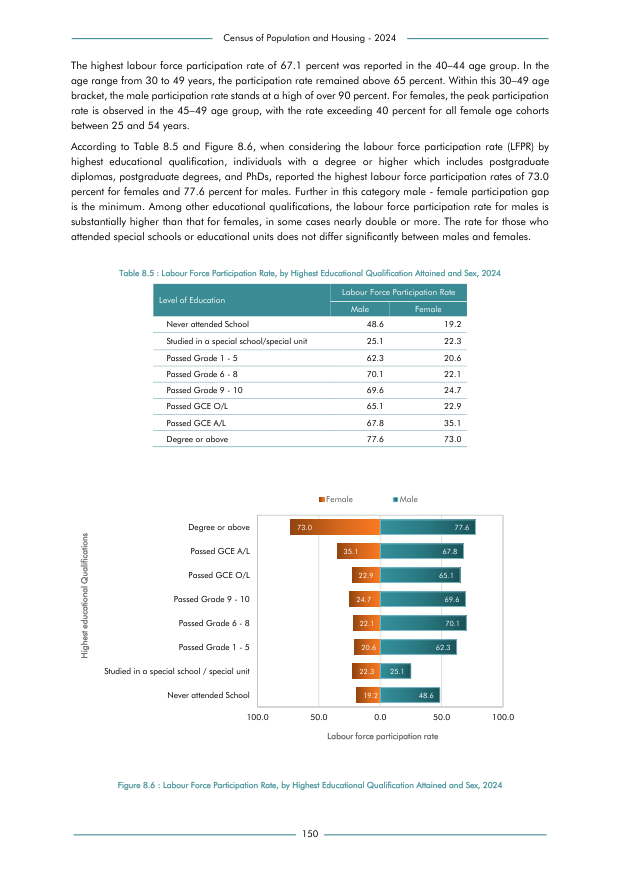

# Labour Force Participation Rate, by Highest Educational Qualification Attained and Sex, 2024


*Table 8.5, Final Report, 2024 Census of Population and Housing, Department of Census and Statistics, Sri Lanka*

## Structured Data (similar to original layout)

```json
[
    {
        "level_of_education": "Never attended School",
        "values": {
            "p_male_labour_force_participation_rate": 0.486,
            "p_female_labour_force_participation_rate": 0.192
        }
    },
    {
        "level_of_education": "Studied in a special school/special unit",
        "values": {
            "p_male_labour_force_participation_rate": 0.251,
            "p_female_labour_force_participation_rate": 0.223
        }
    },
    {
        "level_of_education": "Passed Grade 1 - 5",
        "values": {
            "p_male_labour_force_participation_rate": 0.623,
            "p_female_labour_force_participation_rate": 0.206
        }
    },
    {
        "level_of_education": "Passed Grade 6 - 8",
        "values": {
            "p_male_labour_force_participation_rate": 0.701,
            "p_female_labour_force_participation_rate": 0.221
        }
    },
    {
...
```

- Source File: [data.json (1.5 KB)](../../../../data/final-report-tables/chapter-8/8.5-Labour-Force-Participation-Rate-by-Highest-Educational-Qualification-Attained-and-Sex-2024/data.json)

## Raw Data (directly scraped from PDF)

```json
[
    [
        "Census of Population and Housing - 2024",
        ""
    ],
    [
        "The highest labour force participation rate of 67.1 percent was reported in the 40\u201344 age group. In the",
        ""
    ],
    [
        "age range from 30 to 49 years, the participation rate remained above 65 percent. Within this 30\u201349 age",
        ""
    ],
    [
        "bracket, the male participation rate stands at a high of over 90 percent. For females, the peak participation",
        ""
    ],
    [
        "rate is observed in the 45\u201349 age group, with the rate exceeding 40 percent for all female age cohorts",
        ""
    ],
    [
        "between 25 and 54 years.",
        ""
    ],
    [
        "According  to  Table  8.5  and  Figure  8.6,  when  considering  the  labour  force  participation  rate  (LFPR)  by",
        ""
    ],
    [
...
```
- Source File: [raw_data.json (2.2 KB)](../../../../data/final-report-tables/chapter-8/8.5-Labour-Force-Participation-Rate-by-Highest-Educational-Qualification-Attained-and-Sex-2024/raw_data.json)

## Original PDF Page



- Source File: [original.pdf (46.7 KB)](../../../../data/final-report-tables/chapter-8/8.5-Labour-Force-Participation-Rate-by-Highest-Educational-Qualification-Attained-and-Sex-2024/original.pdf)

## Source

- <https://www.statistics.gov.lk/Resource/en/Population/CPH_2024/CPH2024_Final_Eng.pdf#page=167>


[](https://opensource.org/licenses/MIT)
