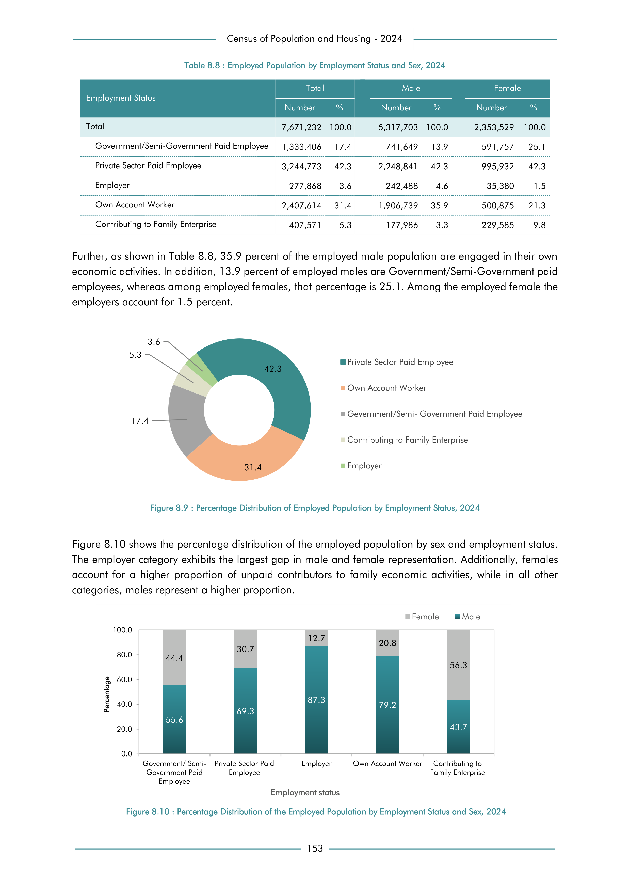

# Employed Population by Employment Status and Sex, 2024


*Table 8.8, Final Report, 2024 Census of Population and Housing, Department of Census and Statistics, Sri Lanka*

## Structured Data formatted for [Lanka Data API](https://github.com/nuuuwan/lanka_data)

```json
{
    "Person": {
        "Time:2024": {
            "EmploymentStatus:GovernmentOrSemiGovernmentPaidEmployee": {
                "Sex:Male": {
                    "EmployedCount": "Int:741649"
                },
                "Sex:Female": {
                    "EmployedCount": "Int:591757"
                }
            },
            "EmploymentStatus:PrivateSectorPaidEmployee": {
                "Sex:Male": {
                    "EmployedCount": "Int:2248841"
                },
                "Sex:Female": {
                    "EmployedCount": "Int:995932"
                }
            },
            "EmploymentStatus:Employer": {
                "Sex:Male": {
                    "EmployedCount": "Int:242488"
                },
                "Sex:Female": {
                    "EmployedCount": "Int:35380"
                }
            },
            "EmploymentStatus:OwnAccountWorker": {
                "Sex:Male": {
                    "EmployedCount": "Int:1906739"
...
```

- Source File: [lanka_data.json (1.1 KB)](../../../../data/final-report-tables/chapter-8/8.8-Employed-Population-by-Employment-Status-and-Sex,-2024/lanka_data.json)

## Structured Data (similar to original layout)

```json
[
    {
        "employment_status": "Government/Semi-Government Paid Employee",
        "values": {
            "male": 741649,
            "female": 591757
        },
        "total_value": 1333406
    },
    {
        "employment_status": "Private Sector Paid Employee",
        "values": {
            "male": 2248841,
            "female": 995932
        },
        "total_value": 3244773
    },
    {
        "employment_status": "Employer",
        "values": {
            "male": 242488,
            "female": 35380
        },
        "total_value": 277868
    },
    {
        "employment_status": "Own Account Worker",
        "values": {
            "male": 1906739,
            "female": 500875
...
```

- Source File: [data.json (793.0 B)](../../../../data/final-report-tables/chapter-8/8.8-Employed-Population-by-Employment-Status-and-Sex,-2024/data.json)

## Raw Data (directly scraped from PDF)

```json
[
    [
        "Employment Status",
        "Total",
        "",
        "Male",
        "",
        "Female",
        ""
    ],
    [
        "",
        "Number",
        "%",
        "Number",
        "%",
        "Number",
        "%"
    ],
    [
        "Total",
        "7,671,232  100.0",
        "",
        "5,317,703",
        "100.0",
        "2,353,529",
        "100.0"
    ],
    [
        "Government/Semi-Government Paid Employee",
...
```
- Source File: [raw_data.json (911.0 B)](../../../../data/final-report-tables/chapter-8/8.8-Employed-Population-by-Employment-Status-and-Sex,-2024/raw_data.json)

## Original PDF Page



- Source File: [original.pdf (54.7 KB)](../../../../data/final-report-tables/chapter-8/8.8-Employed-Population-by-Employment-Status-and-Sex,-2024/original.pdf)

## Source

- <https://www.statistics.gov.lk/Resource/en/Population/CPH_2024/CPH2024_Final_Eng.pdf#page=170>


[](https://opensource.org/licenses/MIT)
