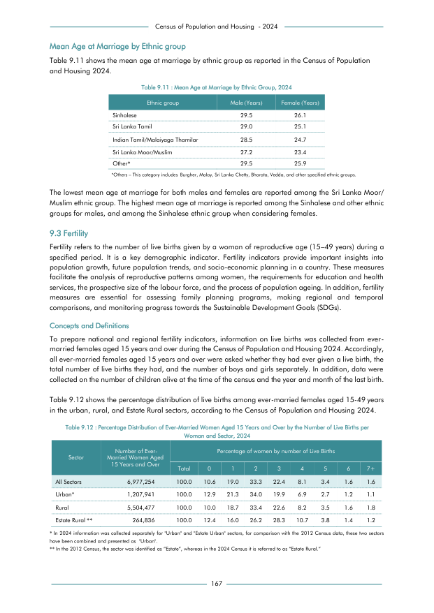

# Mean Age at Marriage by Ethnic Group, 2024


*Table 9.11, Final Report, 2024 Census of Population and Housing, Department of Census and Statistics, Sri Lanka*

## Structured Data (similar to original layout)

```json
[
    {
        "ethnicity": "Sinhalese",
        "values": {
            "mean_age_of_marriage_male": 29.5,
            "mean_age_of_marriage_female": 26.1
        }
    },
    {
        "ethnicity": "Sri Lanka Tamil",
        "values": {
            "mean_age_of_marriage_male": 29.0,
            "mean_age_of_marriage_female": 25.1
        }
    },
    {
        "ethnicity": "Indian Tamil/Malaiyaga Thamilar",
        "values": {
            "mean_age_of_marriage_male": 28.5,
            "mean_age_of_marriage_female": 24.7
        }
    },
    {
        "ethnicity": "Sri Lanka Moor/Muslim",
        "values": {
            "mean_age_of_marriage_male": 27.2,
            "mean_age_of_marriage_female": 23.4
        }
    },
    {
...
```

- Source File: [data.json (759 B)](../../../../data/final-report-tables/chapter-9/9.11-Mean-Age-at-Marriage-by-Ethnic-Group,-2024/data.json)

## Raw Data (directly scraped from PDF)

```json
[
    [
        "",
        "Table 9.11 : Mean Age at Marriage by Ethnic Group, 2024",
        ""
    ],
    [
        "Ethnic group",
        "Male (Years)",
        "Female (Years)"
    ],
    [
        "Sinhalese",
        "29.5",
        "26.1"
    ],
    [
        "Sri Lanka Tamil",
        "29.0",
        "25.1"
    ],
    [
        "Indian Tamil/Malaiyaga Thamilar",
        "28.5",
        "24.7"
    ],
    [
        "Sri Lanka Moor/Muslim",
        "27.2",
        "23.4"
...
```
- Source File: [raw_data.json (441 B)](../../../../data/final-report-tables/chapter-9/9.11-Mean-Age-at-Marriage-by-Ethnic-Group,-2024/raw_data.json)

## Original PDF



- Source File: [original.pdf (82.7 kB)](../../../../data/final-report-tables/chapter-9/9.11-Mean-Age-at-Marriage-by-Ethnic-Group,-2024/original.pdf)

(Table 0 on this page.)

## Source

- <https://www.statistics.gov.lk/Resource/en/Population/CPH_2024/CPH2024_Final_Eng.pdf#page=184>


[](https://opensource.org/licenses/MIT)
