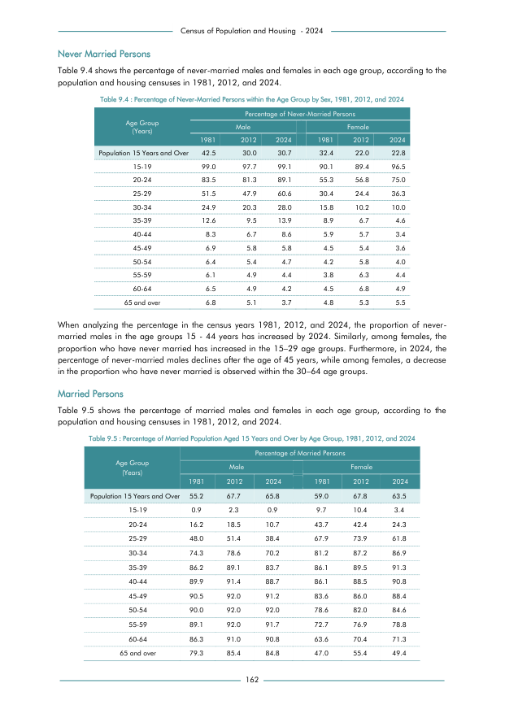

# Percentage of Never-Married Persons within the Age Group by Sex, 1981, 2012, and 2024


*Table 9.4, Final Report, 2024 Census of Population and Housing, Department of Census and Statistics, Sri Lanka*

## Structured Data (similar to original layout)

```json
[
    {
        "age_group": "Population 15 Years and Over",
        "values": {
            "p_never_married_male_1981": 0.425,
            "p_never_married_male_2012": 0.3,
            "p_never_married_male_2024": 0.307,
            "p_never_married_female_1981": 0.324,
            "p_never_married_female_2012": 0.22,
            "p_never_married_female_2024": 0.228
        }
    },
    {
        "age_group": "15-19",
        "values": {
            "p_never_married_male_1981": 0.99,
            "p_never_married_male_2012": 0.977,
            "p_never_married_male_2024": 0.991,
            "p_never_married_female_1981": 0.901,
            "p_never_married_female_2012": 0.894,
            "p_never_married_female_2024": 0.965
        }
    },
    {
        "age_group": "20-24",
        "values": {
            "p_never_married_male_1981": 0.835,
            "p_never_married_male_2012": 0.813,
            "p_never_married_male_2024": 0.891,
            "p_never_married_female_1981": 0.553,
...
```

- Source File: [data.json (3.7 KB)](../../../../data/final-report-tables/chapter-9/9.4-Percentage-of-Never-Married-Persons-within-the-Age-Group-by-Sex-1981-2012-and-2024/data.json)

## Raw Data (directly scraped from PDF)

```json
[
    [
        "",
        "Table 9.4 : Percentage of Never-Married Persons within the Age Group by Sex, 1981, 2012, and 2024",
        "",
        "",
        "",
        "",
        ""
    ],
    [
        "",
        "",
        "",
        "Percentage of Never-Married Persons",
        "",
        "",
        ""
    ],
    [
        "Age Group \n(Years)",
        "",
        "Male",
        "",
        "",
        "Female",
        ""
    ],
    [
        "",
...
```
- Source File: [raw_data.json (1.5 KB)](../../../../data/final-report-tables/chapter-9/9.4-Percentage-of-Never-Married-Persons-within-the-Age-Group-by-Sex-1981-2012-and-2024/raw_data.json)

## Original PDF Page



- Source File: [original.pdf (59.8 KB)](../../../../data/final-report-tables/chapter-9/9.4-Percentage-of-Never-Married-Persons-within-the-Age-Group-by-Sex-1981-2012-and-2024/original.pdf)

(Table 0 on this page.)

## Source

- <https://www.statistics.gov.lk/Resource/en/Population/CPH_2024/CPH2024_Final_Eng.pdf#page=179>


[](https://opensource.org/licenses/MIT)
