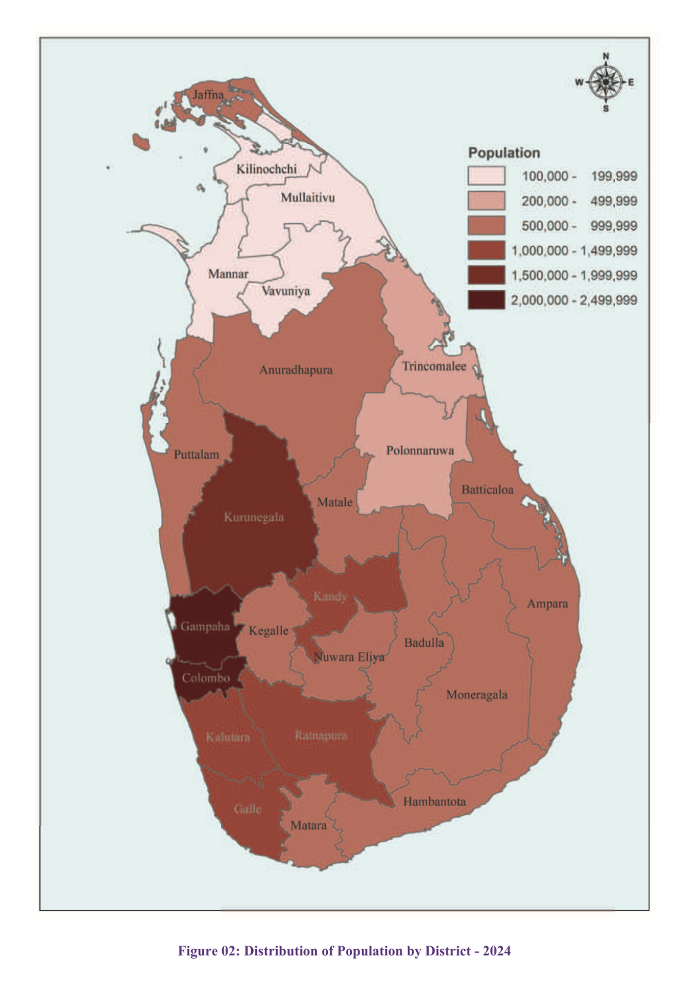
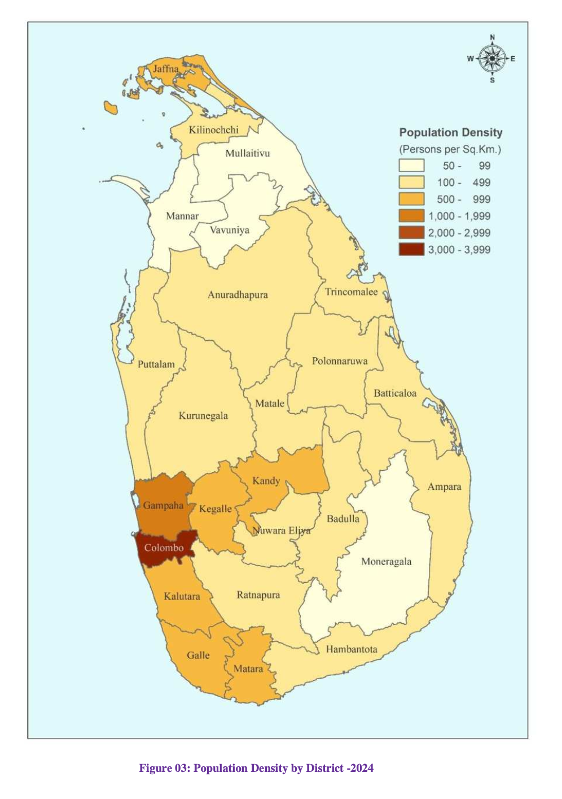

# Population of Sri Lanka by District (`Excerpts`)

*[Source Doc](CPH2024_Preliminary_Report.pdf)*

## Executive Summary

- The enumeration stage of the Census of Population and Housing 2024, the 15th census in Sri Lanka's series of censuses, was conducted from **October 2024 to the second week of February 2025**. The census moment was 00:00 hours on 19th December 2024.
- According to this census, the population of Sri Lanka was recorded as **21,763,170**.
- This census has shown an increase of 1,403,731 compared to the population reported in the Census of Population and Housing 2012.
- During the 2001-2012 inter-census period, the average annual population growth rate was 0.7 percent. For the 2012-2024 inter-census period, the average annual population growth rate is **0.5 percent**. This indicates that while the population growth rate in Sri
Lanka has slowed, the population continues to increase.
- When considering the population by province in Sri Lanka, the **Western Province** has the highest population, accounting for 28.1 percent of the total, while the Northern Province has the lowest, with 5.3 percent of the total population.
- When considering the population distribution at the district level, **Gampaha District** has reported the highest population, with 2,433,685 persons. Colombo District follows, with a population of 2,374,461. Together, only these two districts have a population of over 2 million.
- Apart from Gampaha and Colombo districts, the **highest population** is reported from Kurunegala (1,760,829), Kandy (1,461,269), Kalutara (1,305,552), Ratnapura (1,145,138), and Galle (1,096,585) districts respectively, with each of these districts reporting a population of more than one million.
- As in the previous censuses, districts with the **lowest population** in the country this time are Mullaitivu (122,542), Mannar (123,674), Kilinochchi (136,434) and Vavuniya (172,257) districts in the Northern Province.
- The **highest annual growth rate** of 2.23 percent has been reported from Mullaitivu district. The **lowest annual growth rate** is recorded in Vavuniya District (0.01 percent).
- As in previous censuses, the **highest population density** of 3,549 persons per square kilometer is reported in Colombo District, while the lowest population density is reported in Mullaitivu District, which has a population density of 50 persons per square
kilometer.

## Other Important Points 

1. Postponement: The 15th census, scheduled for 2021, was delayed to 2024 due to COVID-19 and economic crisis.
2. Digital-first census: For the first time, Sri Lanka used Computer-Assisted Personal Interviewing (CAPI) with tablets and smartphones instead of paper forms.
3. Census blocks & maps: The country was divided into 98,430 digital census blocks across 14,008 Grama Niladhari Divisions (GN Divisions) in 340 Divisional Secretariats.
4. Roofless enumeration: People without usual residences (“roofless persons”) were counted nationwide on the night of 18 Dec 2024.
5. Long-term growth trend: Since the first census in 1871 (2.4M people), population rose steadily to 21.8M in 2024; however, growth rates peaked in 1953 (2.8%) and have steadily declined.
6. Urban concentration: Population density has climbed from 230/km² in 1981 → 349/km² in 2024, with Colombo (3,549/km²) far ahead of others.
7. Demographic pressure areas: High densities cluster in Colombo, Gampaha, Kalutara, Kandy, Galle, Matara, and Jaffna.
8. Depopulation risk zones: Low-density regions (under 100/km²) include Mullaitivu, Mannar, Vavuniya, Kilinochchi, Moneragala, Anuradhapura, and Polonnaruwa.
9. Administrative changes: The number of GN Divisions dropped slightly (14,021 in 2012 → 14,008 in 2024), due to projects like Moragahakanda & Kaluganga reservoirs submerging villages.
10. Regional variation in growth: District-level growth shows contrast — Mullaitivu growing rapidly (2.23%) vs. Vavuniya stagnant (0.01%), highlighting uneven demographic trends.

### Table 01: Enumerated population by census year, inter-census growth and average annual growth rate, 1871 - 2024

| Census date     | Enumerated Population | Intercensal increase |                | Average annual growth rate (Percent)  |
|-----------------|----------------------:|---------------------:|---------------:|--------------------------------------:|
|                 |                       | Number               | Percentage     |                                       |
| 1871 March 27   | 2,400,380             | -                    | -              | -                                     |
| 1881 February 17| 2,759,738             | 359,358              | 15.0           | 1.4                                   |
| 1891 February 26| 3,007,789             | 248,051              | 9.0            | 0.9                                   |
| 1901 March 01   | 3,565,954             | 558,165              | 18.6           | 1.7                                   |
| 1911 March 10   | 4,106,350             | 540,396              | 15.2           | 1.4                                   |
| 1921 March 18   | 4,498,605             | 392,255              | 9.6            | 0.9                                   |
| 1931 February 26| 5,306,871             | 808,266              | 18.0           | 1.7                                   |
| 1946 March 19   | 6,657,339             | 1,350,468            | 25.4           | 1.5                                   |
| 1953 March 20   | 8,097,895             | 1,440,556            | 21.6           | 2.8                                   |
| 1963 July 08    | 10,582,064            | 2,484,169            | 30.7           | 2.6                                   |
| 1971 October 09 | 12,689,897            | 2,107,833            | 19.9           | 2.2                                   |
| 1981 March 17   | 14,846,750            | 2,156,853            | 17.0           | 1.7                                   |
| 2001 July 17    | 18,797,257            | 3,950,507            | 26.6           | 1.2                                   |
| 2012 March 20   | 20,359,439            | 1,562,182            | 8.3            | 0.7                                   |
| 2024 December 19| 21,763,170            | 1,403,731            | 6.9            | 0.5                                   |

[JSON Data](Table-01.json)

## Figure 02: Distribution of Population by District - 2024

## Table 03: Population and Annual Growth Rate by District 1981, 2001, 2012 and 2024

| District       | 1981       | 2001       | 2012       | 2024       | Avg Annual Growth Rate (1981-2001) | (2001-2012) | (1981-2012) | (2012-2024) |
|----------------|-----------:|-----------:|-----------:|-----------:|----------------------------------:|------------:|------------:|------------:|
| **Sri Lanka**  | 14,846,274 | 18,797,257 | 20,359,439 | 21,763,170 | 1.16                              | 1.02        | 0.75        | 0.52        |
| Colombo        | 1,675,847  | 2,239,696  | 2,324,349  | 2,374,461  | 1.43                              | 1.05        | 0.35        | 0.17        |
| Gampaha        | 1,367,813  | 2,060,470  | 2,304,833  | 2,433,685  | 2.01                              | 1.68        | 1.05        | 0.43        |
| Kalutara       | 823,964    | 1,065,635  | 1,221,948  | 1,305,552  | 1.26                              | 1.27        | 1.28        | 0.52        |
| Kandy          | 1,032,335  | 1,276,202  | 1,375,382  | 1,461,269  | 1.04                              | 0.92        | 0.70        | 0.47        |
| Matale         | 352,860    | 439,031    | 484,531    | 526,578    | 1.07                              | 1.02        | 0.92        | 0.65        |
| Nuwara Eliya   | 583,716    | 702,689    | 711,644    | 724,957    | 0.91                              | 0.64        | 0.12        | 0.15        |
| Galle          | 805,403    | 989,769    | 1,063,334  | 1,096,585  | 1.01                              | 0.90        | 0.67        | 0.24        |
| Matara         | 642,235    | 760,990    | 814,048    | 837,884    | 0.83                              | 0.76        | 0.63        | 0.23        |
| Hambantota     | 421,277    | 525,913    | 599,903    | 671,037    | 1.09                              | 1.14        | 1.23        | 0.88        |
| Jaffna         | 734,474    | –          | 583,882    | 594,333    | –0.74                             | –           | –           | 0.14        |
| Mannar         | 105,276    | –          | 99,570     | 123,674    | –0.18                             | –           | –           | 1.70        |
| Vavuniya       | 93,694     | –          | 172,115    | 172,257    | –                                 | –           | 1.96        | 0.01        |
| Mullaitivu     | 73,886     | –          | 92,238     | 122,542    | –                                 | –           | 0.71        | 2.23        |
| Kilinochchi    | 90,778     | –          | 113,510    | 136,434    | –                                 | –           | 0.72        | 1.44        |
| Batticaloa     | 329,343    | –          | 526,567    | 595,435    | –                                 | –           | 1.51        | 0.96        |
| Ampara         | 383,275    | 592,596    | 649,402    | 744,150    | 2.14                              | 1.70        | 0.86        | 1.07        |
| Trincomalee    | 250,771    | –          | 379,541    | 442,465    | –                                 | –           | 1.34        | 1.20        |
| Kurunegala     | 1,198,795  | 1,458,385  | 1,618,465  | 1,760,829  | 0.96                              | 0.95        | 0.97        | 0.66        |
| Puttalam       | 485,619    | 709,002    | 762,396    | 818,065    | 1.86                              | 1.45        | 0.68        | 0.55        |
| Anuradhapura   | 575,546    | 742,535    | 860,575    | 959,552    | 1.25                              | 1.30        | 1.38        | 0.85        |
| Polonnaruwa    | 253,411    | 358,804    | 406,088    | 447,338    | 1.71                              | 1.52        | 1.16        | 0.76        |
| Badulla        | 620,839    | 778,422    | 815,405    | 871,763    | 1.11                              | 0.88        | 0.43        | 0.52        |
| Moneragala     | 269,684    | 396,521    | 451,058    | 527,286    | 1.89                              | 1.66        | 1.21        | 1.22        |
| Ratnapura      | 779,927    | 1,016,221  | 1,088,007  | 1,145,138  | 1.30                              | 1.07        | 0.64        | 0.40        |
| Kegalle        | 678,456    | 784,371    | 840,648    | 869,901    | 0.71                              | 0.69        | 0.65        | 0.19        |

[JSON Data](Table-03.json)

## Figure 03: Population Density by District - 2024

